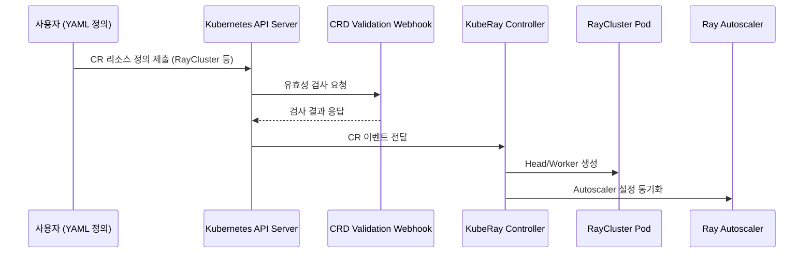

# 4.2 KubeRay 아키텍처

KubeRay는 Ray 클러스터를 Kubernetes 상에서 안정적으로 실행하고 운영하기 위한 오퍼레이터 기반 프레임워크입니다. 이 장에서는 KubeRay의 내부 구성요소와 클러스터가 어떻게 생성되고 관리되는지의 흐름을 살펴봅니다.

## 아키텍처 개요

KubeRay는 Kubernetes API와 Ray 런타임 사이에서 중간 다리 역할을 하며, CRD(Custom Resource Definition)를 통해 Ray 클러스터 리소스를 선언형으로 관리할 수 있도록 구성됩니다.

- 사용자는 RayCluster, RayService, RayJob 등의 CR를 YAML로 정의합니다.
- KubeRay 컨트롤러는 이 CR을 감지하고, 적절한 Ray Pod(Head, Worker)를 생성합니다.
- Webhook은 리소스의 유효성을 검증하고, Autoscaler는 워커 수를 동적으로 조절합니다.

## 주요 컴포넌트

### KubeRay Operator (Controller)

- `controller-manager`로 실행되는 핵심 컨트롤러입니다.
- RayCluster CR을 감지하고 Head/Worker Pod를 생성 및 관리합니다.
- Serve 설정 변경 시 롤링 업데이트 처리

### Autoscaler

- 클러스터 내부에 동작하는 Ray 자체 Autoscaler입니다.
- 워커 노드 수를 워크로드에 따라 자동 증가/감소시킵니다.
- 수평 Pod 오토스케일링(HPA) 또는 Karpenter와 연계 가능

#### Kubernetes HPA와의 차이점

Ray는 자체 Autoscaler를 통해 클러스터 내 Worker Pod 수를 자동으로 조절합니다. 이는 Kubernetes의 Horizontal Pod Autoscaler(HPA)와는 작동 방식이 다릅니다.

| 항목 | Ray Autoscaler | Kubernetes HPA |
|------|----------------|----------------|
| 스케일 기준 | Ray 내부 작업(Task, Actor) 수요 | CPU/메모리 사용률 |
| 제어 대상 | Ray Worker Pod 수 | 일반 Pod 수 |
| 작동 위치 | Ray Head Pod 내부 컨트롤러 | Kubernetes 컨트롤러 |
| 연동 여부 | 기본 내장 (KubeRay와 통합됨) | 수동 구성 필요 |
| 목적 | 클러스터 전체 워크로드 조절 | 특정 애플리케이션 Pod 조절 |

Ray Autoscaler는 Kubernetes HPA처럼 리소스 사용률 기반이 아니라, Ray 클러스터 내부의 워크로드 상태(Task/Actor 수요)에 따라 판단하여 확장·축소합니다. 따라서 Ray 클러스터의 안정성과 분산성 확보를 위해 기본적으로 Ray Autoscaler를 사용하는 것이 일반적입니다.

### CRD Webhook

- 유저가 제출한 CR의 스펙 유효성(필수 필드, 형식 등)을 서버 측에서 검사합니다.
- 오류가 있는 CR이 적용되지 않도록 사전 차단하는 기능 수행

## 데이터 흐름

1. 사용자가 `RayCluster`, `RayService`, `RayJob` 리소스를 정의해 API 서버에 등록
2. 컨트롤러는 이를 감지하고 적절한 Pod, Service, PVC를 생성
3. Serve Deployment 변경 시 Controller는 무중단 롤링 업데이트 수행
4. 워크로드 변화에 따라 Autoscaler가 워커 수를 자동 조절
5. 상태 및 결과는 Ray Dashboard 또는 Kubernetes 리소스 상태로 확인 가능

---

KubeRay 아키텍처는 Ray의 유연한 분산 처리 능력을 Kubernetes의 선언형 관리 모델과 결합해, 안정성과 확장성을 동시에 제공합니다. 다음 장에서는 KubeRay에서 사용하는 주요 CRD 필드를 자세히 살펴보겠습니다.
